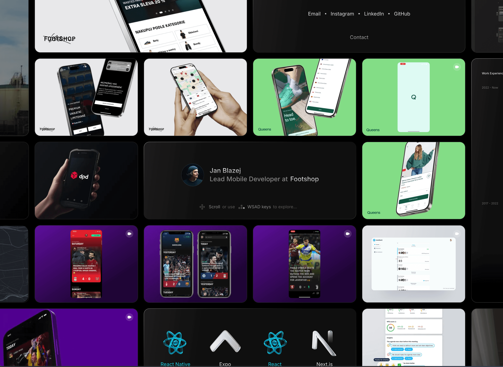

# Portfolio

Personal portfolio site with a 2D camera navigation system — the entire home page is a pannable, zoomable canvas of cards instead of a traditional scrolling page.

**[janblazej.dev](https://janblazej.dev)**

## Tech Stack

- **Next.js 15** (App Router, Turbopack)
- **React 19**
- **TypeScript**
- **Tailwind CSS v4** (PostCSS)
- **GSAP** — animations (modals, galleries, hovers, text reveals)
- **Biome** — linting and formatting

## Features

- **2D camera navigation** — pan and zoom across a virtual 4368x3318px canvas
- **Multi-input controls** — scroll, keyboard, drag, and touch
- **Infinite-scroll illusion** — 4 translated grid copies create seamless wrapping
- **Data-driven cards** — all content defined as typed entries (`shot`, `contact`, `map`, `cv`, `profile`, `gallery`, `technologies`)
- **Responsive scaling** — CSS breakpoints from mobile to 5K+ displays
- **Static generation** — project detail pages pre-rendered from shot entries

## Getting Started

**Prerequisites:** Node.js 18+ and Yarn

```bash
yarn install
yarn dev        # Dev server with Turbopack at http://localhost:3000
```

Production build:

```bash
yarn build
yarn start
```

## Project Structure

```
src/
  app/              # Next.js App Router pages and layouts
    (home)/         # Home page — camera-based portfolio grid
    [slug]/         # Individual project detail pages
    cv/             # CV page
    api/            # API routes (projects JSON endpoint)
  components/       # Shared UI components
  config/           # Site configuration (layout dimensions, contacts, etc.)
  db/               # Content database
    entries/        # Individual entry files (one per card)
    types.ts        # Entry type definitions
    index.ts        # Combined entries array and helpers
  hooks/            # Custom React hooks
  providers/        # React context providers
    CameraProvider/ # Camera system (state, controls, viewport, grid)
  utils/            # Utility functions (cn, etc.)
```

## Architecture

### Camera System

`CameraProvider` (`src/providers/CameraProvider/`) is the core abstraction. It manages camera position, viewport CSS transforms, and 4 grid transforms for the infinite-scroll illusion.

Input is handled by dedicated control modules: `ScrollControls`, `KeyboardControls`, `DragControls`, and `ToucheControls`. The `Viewport` component applies the CSS transform, and `Grid` renders 4 translated copies of the card layout.

### Entry / Card System

Content is defined in `src/db/entries/` as individual TypeScript files following types from `src/db/types.ts`. The home page maps entries to card components via a switch on `entry.variant`. Cards are positioned on the CSS grid using each entry's `area` field.

### Routing

| Route | Description |
|---|---|
| `/` | Interactive camera-based portfolio grid |
| `/[slug]` | Project detail pages (statically generated) |
| `/cv` | CV page |
| `/api/projects` | JSON endpoint returning all entries |

## Scripts

| Command | Description |
|---|---|
| `yarn dev` | Dev server with Turbopack |
| `yarn build` | Production build |
| `yarn start` | Start production server |
| `yarn format` | Format with Biome |
| `yarn lint` | Lint with Biome |
| `yarn check` | Full Biome check (lint + format + assist) |
| `yarn ts:check` | TypeScript type checking |
| `yarn gen:imports` | Regenerate entry imports from `db/entries/` |
| `yarn db:validate` | Validate database entry slugs |

## Adding Content

To add a new portfolio entry:

1. Create an entry file in `src/db/entries/` following the `EntryShot` type
2. Run `yarn gen:imports` to regenerate the imports
3. Run `yarn db:validate` to verify slugs

## Code Style

- **Biome** — single quotes, no semicolons, 2-space indent, 120-char line width
- **Tailwind CSS v4** with custom `@utility` definitions in `app.css`
- **Path alias:** `@/*` maps to `src/*`
- Object keys auto-sorted (`useSortedKeys`)
- Class names merged with `cn()` utility (clsx + tailwind-merge)
